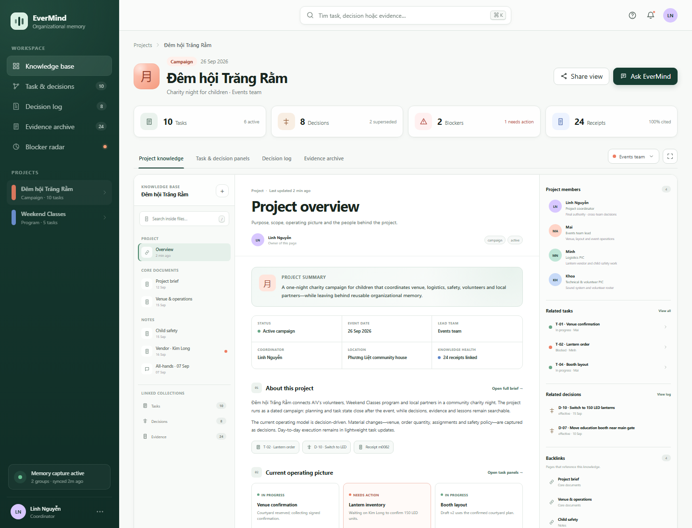

# EverMind knowledge-base UI demo

Standalone interactive prototype with two connected product surfaces:

- **Project Knowledge Base** — document-first project overview, structured notes,
  project members and roles, typed references, and backlinks.
- **Task & Decision Panels** — graph/inspector drill-through for task state,
  dependencies, decision lineage, and evidence receipts.

The underlying relationship remains:

```text
Project → Tasks ↔ Task dependencies
Task ↔ Decisions → Decision lineage
Decision / update ↔ Evidence receipts
```

## Run

Open `index.html` directly in a browser. No build or package installation is
required.

For a local HTTP server:

```powershell
python -m http.server 4173 --directory knowledgebase_demo
```

Then open `http://localhost:4173`.

## Interactions

- Browse project documents from the knowledge tree and inspect project roles,
  related work, decisions, and backlinks in the context panel.
- Search across complete file content, including section text, bullets, linked
  evidence excerpts, task IDs, and decision IDs.
- Follow inline task or decision references into the Task & Decision Panels.
- Select task nodes to inspect current state, dependencies, decisions, and receipts.
- Select a decision to replace the task inspector with a decision-specific panel;
  evidence opens only from receipts inside that panel.
- Decision Log is full-width until a decision is selected; Evidence Archive is
  always full-width and never keeps an unrelated task inspector.
- Toggle inactive decisions to reveal or hide superseded history.
- Open a decision or evidence receipt to inspect the pinned source revision and backlinks.
- Switch between Project Knowledge, Task & Decision Panels, Decision Log, and Evidence Archive.
- Use `Ctrl/Cmd + K` or `/` for cross-entity search.
- Use the Ask EverMind button to preview a natural-language knowledge query.

All data is local demo data. The prototype has no backend or external runtime dependency.

## Preview


